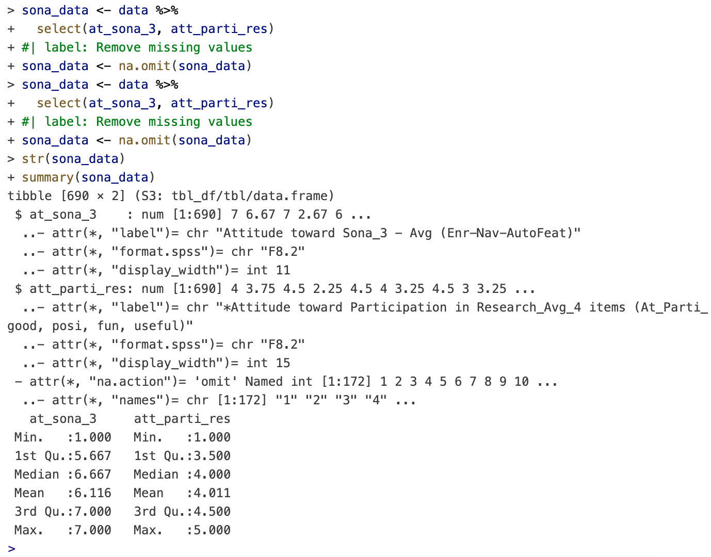
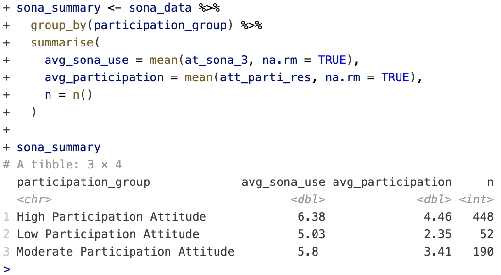
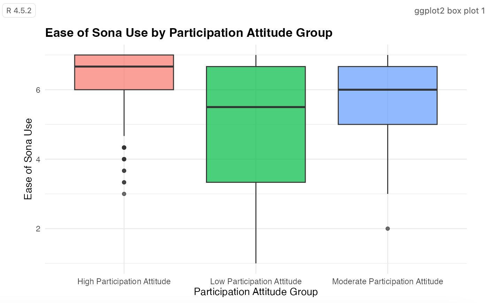
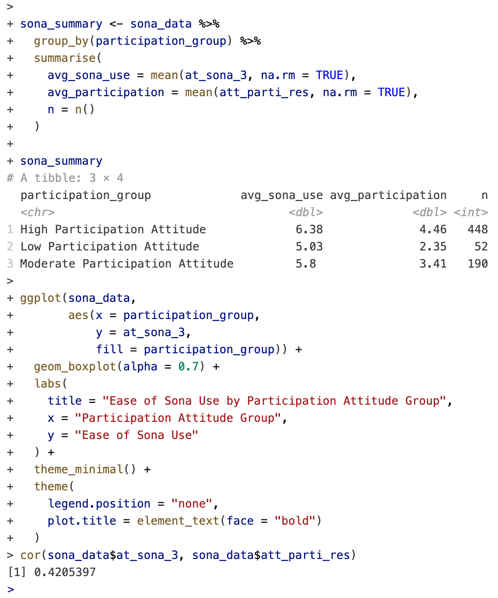

# Marketing Analytics Dashboard

Applied analytics projects focused on transforming raw data into actionable insights through research workflows, statistical visualization, and exploratory analysis.

 

::: {.callout-note appearance="minimal"}
## Core Focus Areas

- Marketing analytics  
- Exploratory data analysis  
- Statistical visualization  
- Consumer research insights  
- Data wrangling workflows  
- Analytical storytelling
:::

***

# Research & Analytics Workflow

## Data Wrangling & Cleaning

::: {.columns}

::: {.column width="55%"}

The dataset was imported and cleaned in **R** using structured data wrangling workflows. Variables unrelated to the research question were removed, missing observations were filtered out, and the remaining dataset was standardized for analysis.

This process improved consistency across observations and created a cleaner foundation for exploratory analysis and visualization.

:::

::: {.column width="45%"}

{width=100%}

:::
:::

 

## Grouped Summary Analysis

::: {.columns}

::: {.column width="45%"}

{width=100%}

:::

::: {.column width="55%"}

After cleaning the dataset, observations were grouped into participation attitude categories to compare average usability perceptions and participation sentiment across segments.

The grouped summaries helped identify trends in how students interacted with the Sona research participation platform.

:::
:::

***

# Statistical Visualization & Findings

## Participation Attitudes and Sona Usability

::: {.columns}

::: {.column width="55%"}

The visualization suggests that students with more positive participation attitudes generally reported stronger usability experiences with Sona.

Lower participation groups showed greater variability and lower average usability scores, indicating a less consistent platform experience among disengaged participants.

:::

::: {.column width="45%"}

{width=100%}

:::
:::

 

## Relationship Analysis

::: {.columns}

::: {.column width="45%"}

{width=100%}

:::

::: {.column width="55%"}

Exploratory analysis identified a moderate positive relationship between Sona usability and attitudes toward research participation.

## Correlation Coefficient: 0.42

A positive correlation of **0.42** suggests that students who found the platform easier to use were generally more likely to report positive attitudes toward participating in research activities.

:::
:::

***

# Tools & Technologies

::: {.columns}

::: {.column width="50%"}

### Analytics Tools

- R  
- Positron  
- tidyverse  
- ggplot2  
- SPSS datasets  
- GitHub

:::

::: {.column width="50%"}

### Analytical Skills

- Data wrangling  
- Exploratory data analysis  
- Statistical visualization  
- Research interpretation  
- Data storytelling  
- Workflow management

:::
:::

***

# Certifications & Supplemental Training

::: {.columns}

::: {.column width="55%"}

Completed supplemental analytics training focused on:

- Google Cloud BigQuery  
- Looker Studio  
- Dashboard reporting workflows  
- Data visualization concepts  
- Analytics infrastructure fundamentals

These certifications strengthened experience working with reporting systems and analytical interpretation workflows commonly used in digital marketing and business analytics environments.

:::

::: {.column width="45%"}

{width=100%}

:::
:::