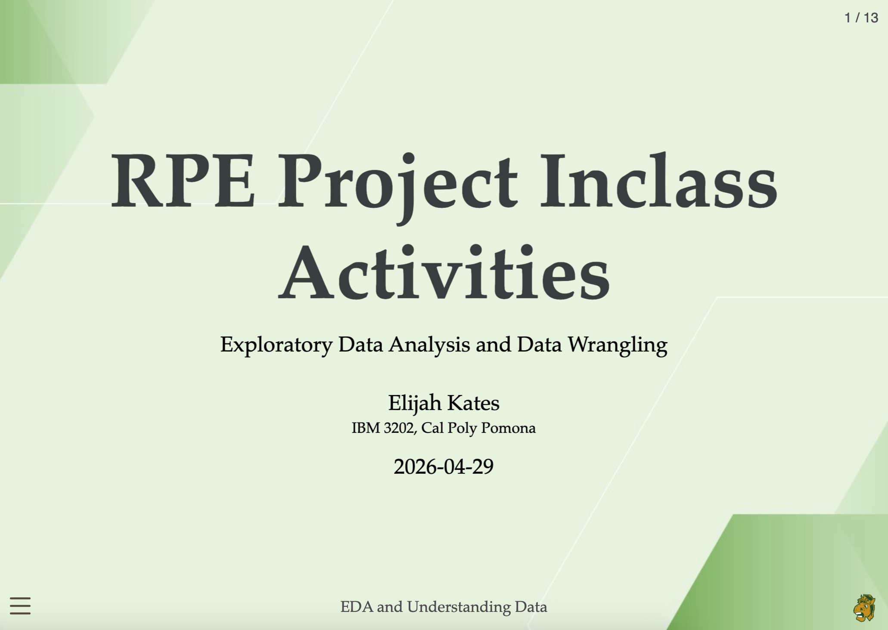

# Research Presentation

A featured presentation showcasing applied research, data analysis, and marketing insights developed through coursework at Cal Poly Pomona.

[Open Full Presentation](presentation/finalrpe-presentation.html){.btn .btn-primary target="_blank"}

---

## Project Overview

This presentation explores student attitudes toward research participation systems and analyzes relationships between ease of use, participation attitudes, and engagement.

### Tools Used

- R
- Quarto
- ggplot2
- Tidyverse
- RevealJS
- Statistical Analysis

---

## Key Areas Covered

- Data wrangling and cleaning
- Exploratory data analysis
- Correlation analysis
- Data visualization
- Interpretation of survey findings
- Team research collaboration

---

## Presentation Preview

::: {.presentation-preview}

:::